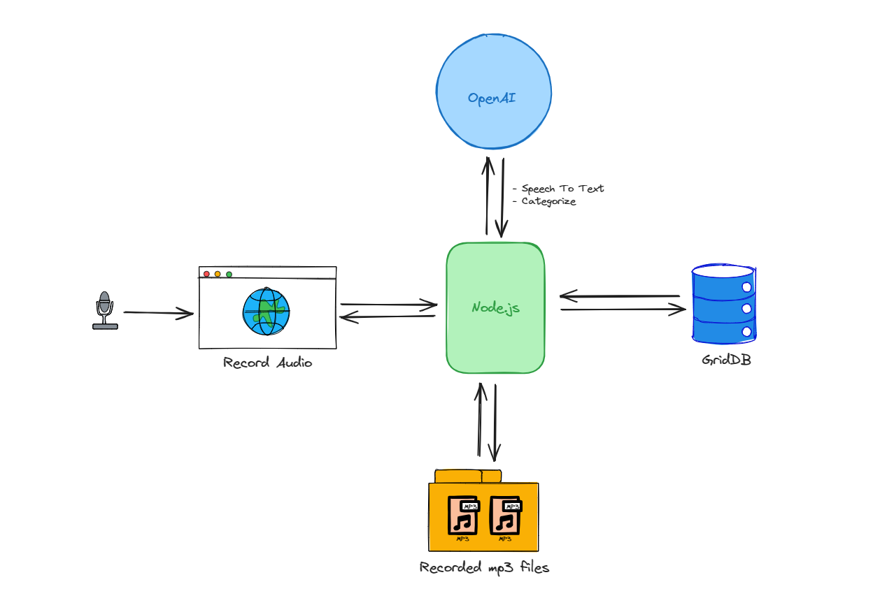

# Building AI Voice Note


This project leverages [Node.js](https://nodejs.org/en/download/) for its backend, utilizing its non-blocking, event-driven architecture to ensure our AI Voice Note application is fast and scalable. We're integrating [GridDB](https://docs.griddb.net/latest/about/what-is-griddb/) for data storage, chosen for its high performance and scalability when dealing with large sets of structured data, making it ideal for handling the complex and voluminous data generated by voice notes. [OpenAI's Speech to text APIs](https://platform.openai.com/docs/guides/speech-to-text) are at the core of our application, enabling advanced natural language processing capabilities that allow for transcription, analysis, and categorization of voice notes. By combining these technologies, we aim to create a robust, efficient tool that simplifies note-taking, turning spoken language into organized, easily retrievable information.

## How it Works?



The architecture of the AI Voice Note application can be simplified into a few steps:

1. Users record audio through a web interface, which then sends the audio data to a Node.js server.

2. Node.js processes this data and saving the recordings as MP3 files in persistent storage.

3. Simultaneously, Node.js interacts with OpenAI's API to transcribe the audio to text and categorize the content.

4. The transcribed and categorized data is then stored in GridDB, a scalable NoSQL database.

The process flow is a bidirectional interaction between Node.js and both the database and the AI service, this make Node.js acts as the central hub for data management and processing within the application.

## Setup & Installation

Clone the project code from [this repository](https://github.com/junwatu/ai-voice-note),

```shell
git clone git@github.com:junwatu/ai-voice-note.git
```

Change directory to `app` dir

```shell
cd ai-voice-note
cd app
```

Install dependencies using `npm`

```shell
npm install
```

Run the project

```shell
npm run start
```

By default the port running on 3000. Use this URL to open the AI Voice Note app:

```shell
http://localhost:3000
```


## Record Audio


## Create Node.js Server

Node.js server will save the recordings as `.webm` files in persistent storage and then will sent the audio file to OpenAI for speech to text recognition.

The Node.js server sets up an Express server route that handles **POST** requests at the `/upload` endpoint. It uses `multer` middleware to process a single file upload from the request.

```javascript
app.post('/upload', upload.single('file'), async (req, res) => {
 if (req.file) {
  // The path to the uploaded audio file
  const filePath = join(__dirname, 'uploads', req.file.filename);

  try {
   // Perform speech-to-text on the uploaded file
   const transcription = await openai.audio.transcriptions.create({
    file: fs.createReadStream(filePath),
    model: "whisper-1",
   });

   console.log(transcription.text);

   // eslint-disable-next-line no-unused-vars
   const speechData = {
    filename: filePath,
    text: transcription.text,
    category: "voice note"
   }

   // Process data to GridDB database
   // Save the transcription data to GridDB
   const saveStatus = await saveData(speechData);

   res.json({
    message: 'Successfully uploaded file and saved data',
    transcription: transcription.text,
    saveStatus: saveStatus
   });
  } catch (error) {
   console.error('Error during transcription:', error);
   res.status(500).json({ message: 'Error during transcription', error: error.message });
  }
 } else {
  res.status(400).json({ message: 'No file uploaded' });
 }
});
```

When a recorded audio file is uploaded, generally these will happens:

1. The server generates a path for the file based on the current directory and a `uploads` subdirectory.
2. It attempts to transcribe the audio file to text using OpenAI's audio transcription API, using the [`whisper-1`](https://platform.openai.com/docs/models/whisper) model.
3. If successful, it logs the transcription to the console and creates an object with the file path, transcribed text, and a hard-coded category of **voice note**.
4. This data then need to be saved to a GridDB database.
5. The server then sends a JSON response back to the client, indicating success and including the transcription text.
6. If an error occurs during transcription, it logs the error and sends back a 500 status with an error message.

7. If no audio file is uploaded, it responds with a 400 status, indicating a bad request.

## Speech to Text Using OpenAI

OpenAI have capabilities to turn audio into text or [speech to text](https://platform.openai.com/docs/guides/speech-to-text) feature. The Audio API provides two speech to text endpoints, `transcriptions` and `translations`, based on the state-of-the-art open source large-v2 **Whisper** model. They can be used to:

- Transcribe audio into whatever language the audio is in.
- Translate and transcribe the audio into english.

File uploads are currently limited to 25 MB and the following input file types are supported: `mp3`, `mp4`, `mpeg`, `mpga`, `m4a`, `wav`, and `webm`.

In this project, we will use the transcription feature and limit file type to `webm`. The code to transcribe an audio file:

```javascript
const transcription = await openai.audio.transcriptions.create({
    file: fs.createReadStream(filePath),
    model: "whisper-1",
});
```

The transcriptions API takes as input the audio file you want to transcribe and the desired output file format for the transcription of the audio. By default, the response type will be json with the raw text included.


## Save Data to GridDB

## Voice Note History

## Further Enhancements
