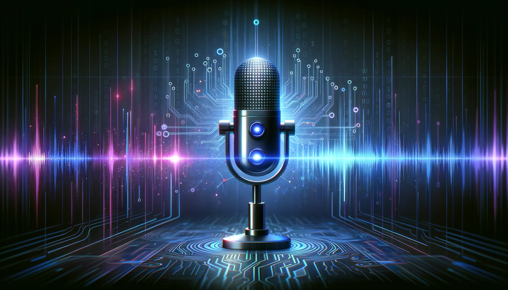

# Building AI Voice Note

This project leverages[Node.js](https://nodejs.org/en/download/) for its backend, utilizing its non-blocking, event-driven architecture to ensure our AI Voice Note application is fast and scalable. We're integrating [GridDB](https://docs.griddb.net/latest/about/what-is-griddb/) for data storage, chosen for its high performance and scalability when dealing with large sets of structured data, making it ideal for handling the complex and voluminous data generated by voice notes. [OpenAI's Speech to text APIs](https://platform.openai.com/docs/guides/speech-to-text) are at the core of our application, enabling advanced natural language processing capabilities that allow for transcription, analysis, and categorization of voice notes. By combining these technologies, we aim to create a robust, efficient tool that simplifies note-taking, turning spoken language into organized, easily retrievable information.